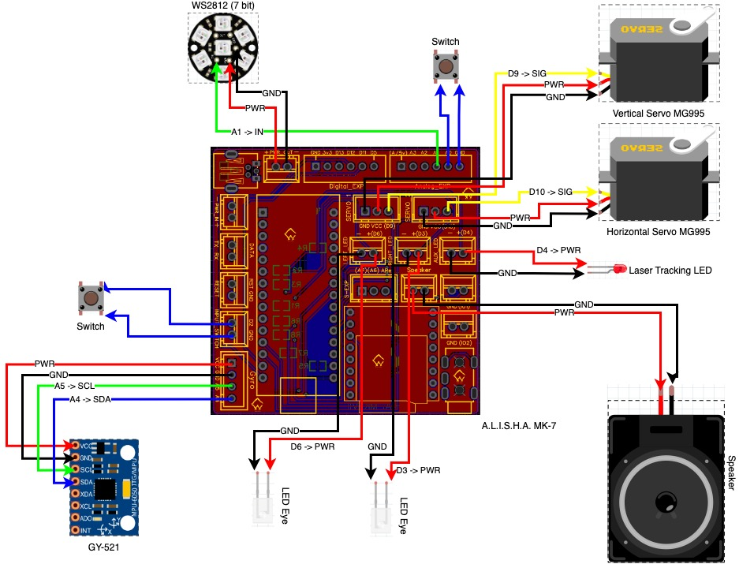

# Predator Servo and Audio Controller for Arduino

The purpose of this project is to enable special effects for your Predator cosplay by motorizing the shoulder cannon, laser tracking and sound effects.  The project enables motion tracking using a simple Arduino and accelerometer.

The original predator this project was based on was developed by Moe Sizzlac and his page can
be found below. You can refer to his page for a lot of the process except for a few things that
are notated in this document.

Moe's Project: http://www.moesizzlac.com/projects-predator.php

YouTube Demo: [https://www.youtube.com/watch?v=h-8c63qdrVE](https://www.youtube.com/watch?v=h-8c63qdrVE)

## Follow Us

[![alt text][6.1]][6]  [![alt text][1.1]][1]  [![alt text][2.1]][2]  [![alt text][3.1]][3]   [![alt text][4.1]][4]    [![alt text][5.1]][5]

[1]: https://www.instagram.com/crash_works_3d/
[2]: https://www.youtube.com/channel/UCc6sTimx9tm5H4AzqxZHS1A
[3]: https://github.com/
[4]: https://www.thingiverse.com/crashworks3d/designs
[5]: https://www.facebook.com/groups/cosplayspecialeffectsprops
[6]: https://linktr.ee/crashworks3d
[1.1]: images/instagram.png (Instagram - Crash Works 3D)
[2.1]: images/youtube.png (YouTube - Dropwire)
[3.1]: images/github.png (Github - Crash Works)
[4.1]: images/Thingiverse.png (Thingiverse - Crash Works)
[5.1]: images/facebook.png (Facebook - Crash Works)
[6.1]: images/linktree.png (Link Tree)

## Getting Started

It will be helpful but not necessary if you have a basic level of programming experience as well as a little experience programming Arduino micro controllers.  This project was created using the [Aurduino IDE](https://www.arduino.cc/).  Clone or download this repository at your own risk.

You can download the 3D printable Predator items from Thingiverse:

https://www.thingiverse.com/thing:4056653

**You can purchase an easy to install and use Arduino shield (Nano included) designed specifically for this project. This Board comes pre-flashed with the Crashworks code installed.**

**_A.L.I.S.H.A._ - Arduino nano Led & Integrated Servo Helmet Actuator for 3D Printed Helmets**

### Prerequisites

* Some experience with [Arduino](https://www.arduino.cc/)

* Be sure to have the Arduino Nano board installed in your environment.

[TODO: more stuff...]

### Installing

1.  In the Arduino IDE be sure to set the appropriate board (Arduino Nano) and ports to match your environment.
2. Complile and load onto your Arduino Nano following the [Arduino IDE instructions](https://www.arduino.cc/en/Guide).

> Alternatively, you can use VSCode to build and upload your code.  
See: [https://code.visualstudio.com/](https://code.visualstudio.com/) using the Arduino extension: [https://github.com/microsoft/vscode-arduino](https://github.com/microsoft/vscode-arduino)

3. Download and install the `ServoEasing` library from here: [https://github.com/ArminJo/ServoEasing](https://github.com/ArminJo/ServoEasing)
4. Download and install the `MPU6050_light` library from here: [https://github.com/rfetick/MPU6050_light](https://github.com/rfetick/MPU6050_light)
5. Download and install the `FastLED` library from here: [https://github.com/FastLED/FastLED](https://github.com/FastLED/FastLED)
6. Download and install the `OneButton` library from here: [https://github.com/mathertel/OneButton](https://github.com/mathertel/OneButton)
7. Download and install the `DFPlayer` library from here: [https://github.com/enjoyneering/DFPlayer](https://github.com/enjoyneering/DFPlayer)

Successful installation will result in a sketch build without errors

## Wiring Diagram

## BOM - A.L.I.S.H.A.
Most components can be found on [Amazon](https://www.amazon.com), [eBay](https://www.ebay.com) or [AliExpress](https://www.aliexpress.com)
* Crashworks 3D A.L.I.S.H.A. module with Arduino Nano: eBay Links: [https://linktr.ee/crashworks3d](https://linktr.ee/crashworks3d)
* GY-521 Gyroscope module
* Cosplay Iron Man/Batman LEDs (can be found on eBay or AliExpress)
* 2x MG995 Servo
* 3 Watt 8 ohm speaker or external powered speaker (recommended)
* Micro SD Card
* USB Power Supply (5 volts 2 amps recommended)
* 2x Momentary Switch

## Built With

* [Arduino](https://www.arduino.cc/)

## Versioning

Version Alpha 0.1 (Use at your own risk) 

## Authors

* **Dropwire**

* **Cranshark @ i3 Creations**

* **Taff**

## License

This project is licensed under the MIT License - see the [LICENSE.md](LICENSE.md) file for details

## Acknowledgments/ Hat Tip
* [Moe Sizzlac](http://www.moesizzlac.com/projects-predator.php)
* [i3 Creations, LLC](https://github.com/i3creations)
* [Dropwire](https://github.com/Acollazo7)
* [Arduino](https://www.arduino.cc/)
* [Fritzing](https://fritzing.org/)
